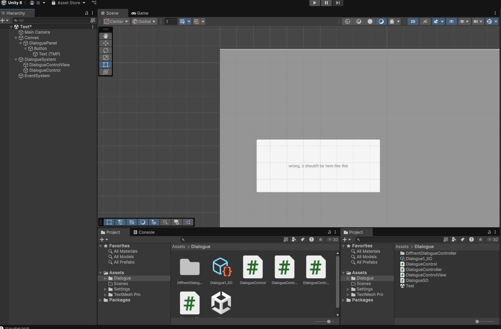
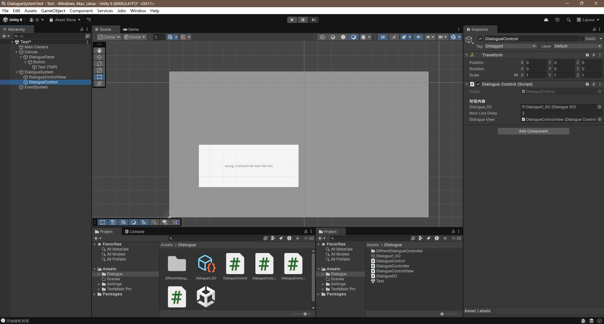
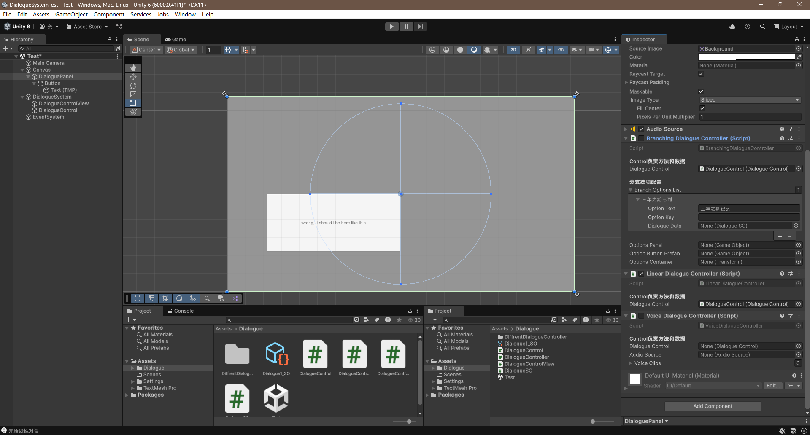

# Unity对话系统使用文档

## 系统简介

这是一个模块化、可扩展的Unity对话系统，支持线性对话、分支对话和语音对话等多种对话形式。系统采用MVC结构设计，将数据、逻辑和视图分离，便于维护和扩展。







## 系统结构

系统由以下几个核心组件构成：

### 数据层
- **DialogueSO** - 对话数据容器（ScriptableObject）
  - 存储对话内容和角色信息
  - 支持角色名称、立绘和对话文本

### 控制层
- **DialogueControl** - 核心控制类
  - 管理对话流程和内容展示
  - 提供事件系统用于监听对话状态
  
- **DialogueController** - 对话控制器基类
  - 提供通用功能和接口
  - 可继承实现不同类型的对话控制器
  
  派生的控制器：
  - **LinearDialogueController** - 线性对话实现
  - **BranchingDialogueController** - 分支对话实现
  - **VoiceDialogueController** - 语音对话实现

### 视图层
- **DialogueControlView** - 用户界面控制
  - 负责对话内容的可视化呈现
  - 实现打字机效果和用户交互

## 系统配置

### 1. 创建对话数据

1. 在项目面板右键 -> Create -> Scriptable Objects -> DialogueSO
2. 设置对话内容：
   - 角色名称
   - 角色立绘（可选）
   - 对话行列表

### 2. 场景层级设置

```
Hierarchy:
├── DialogueSystem
│   ├── DialogueControl       (添加 DialogueControl.cs)
│   └── DialogueControlView   (添加 DialogueControlView.cs)
└── Canvas
    └── DialoguePanel         (UI面板，设置为 DialogueControlView 的对话面板)
        └── Button            (对话按钮，设置为 DialogueControlView 的按钮)
            └── Text (TMP)    (对话文本，设置为 DialogueControlView 的文本组件)
```

### 3. 组件配置

1. 将创建的 DialogueSO 赋值给 DialogueControl 的 `dialogue_SO` 字段
2. 将 DialogueControlView 赋值给 DialogueControl 的 `dialogueView` 字段
3. 设置 DialogueControlView 的 UI 组件引用：
   - 对话面板
   - 下一行按钮
   - 对话文本组件
   - 打字速度等参数

### 4. 添加对话控制器

根据需求，选择添加以下之一（或多个）：

- **LinearDialogueController**：普通顺序对话
- **BranchingDialogueController**：分支选项对话
- **VoiceDialogueController**：带语音的对话
- **CustomDialogueController**：自定义对话控制器(可以自己写哦)

## 核心组件详解

### DialogueSO

对话数据容器，存储对话内容和角色信息：

```csharp
public class DialogueSO : ScriptableObject
{
    public string characterName;        // 角色名称1
    public string characterName2;       // 角色名称2
    public Sprite Character_Image;      // 角色立绘1
    public Sprite Character_Image2;     // 角色立绘2
    public List<string> dialoguelinesList; // 对话行列表
}
```

### DialogueControl

核心控制类，管理对话流程：

重要公共方法：
- `ShowDialogue()` - 显示对话
- `ShowNextLine()` - 显示下一行对话
- `SetDialogueSO(DialogueSO)` - 切换对话数据
- `GoDialogueSOToLine(DialogueSO, int)` - 跳转到特定对话行
- `SkipDialogue()` - 跳过当前对话

重要事件：
- `OnDialogueStarted` - 对话开始事件
- `OnDialogueEnded` - 对话结束事件
- `OnDialogueLineChanged` - 对话行变更事件

### DialogueControlView

UI控制类，负责对话的可视化呈现：

重要公共方法：
- `ShowDialoguePanel()` - 显示对话面板
- `HideDialoguePanel()` - 隐藏对话面板
- `TypeDialogueLine(string)` - 显示带打字效果的文本
- `CompleteCurrentLine()` - 立即完成当前打字效果
- `SetTypingSpeed(float)` - 设置打字速度

## 对话控制器

### 线性对话 (LinearDialogueController)

最基础的对话形式，按顺序显示对话内容：

```csharp
// 将 LinearDialogueController 添加到场景中的对象
public class LinearDialogueController : DialogueController
{
    // 在 Start() 中自动开始对话
    private void Start()
    {
        StartDialogue();  
    }
}
```

### 分支对话 (BranchingDialogueController)

提供多选项对话分支：

```csharp
public class BranchingDialogueController : DialogueController
{
    // 需要配置对话选项
    [SerializeField] private List<DialogueOption> branchOptionsList;
    [SerializeField] private GameObject optionsPanel; 
    [SerializeField] private GameObject optionButtonPrefab;
    [SerializeField] private Transform optionsContainer;
    
    // 重要方法
    public void ShowDialogueOptions()  // 显示对话选项
    public void ChooseOption(string)   // 选择对话分支
}
```

### 语音对话 (VoiceDialogueController)

同步播放语音的对话：

```csharp
[RequireComponent(typeof(AudioSource))]
public class VoiceDialogueController : DialogueController
{
    [SerializeField] private AudioSource audioSource;
    [SerializeField] private List<AudioClip> voiceClips; // 需配置与对话行数量匹配的语音
}
```

## 高级使用方法

### 对话事件监听

通过订阅事件实现自定义行为：

```csharp
// 监听对话开始、结束事件
dialogueControl.OnDialogueStarted += OnDialogueStarted;
dialogueControl.OnDialogueEnded += OnDialogueEnded;

// 监听对话行变更事件（对语音播放特别有用）
dialogueControl.OnDialogueLineChanged += OnDialogueLineChanged;
```

### 分支对话配置

在 Inspector 中配置分支对话选项：

1. 为每个分支创建 DialogueSO
2. 在 BranchingDialogueController 中添加选项
3. 设置选项文本、键值和对应的 DialogueSO

### 自动显示选项

在分支对话中，可在对话结束后自动显示选项：

```csharp
// 在 Awake 或 Start 中添加：
if (dialogueControl != null)
{
    dialogueControl.OnDialogueEnded += (sender, args) => {
        ShowDialogueOptions();
    };
}
```

## 完整使用流程示例

1. **创建对话数据**
   - 创建多个 DialogueSO 资源
   - 填充对话内容和角色信息

2. **配置场景**
   - 添加 Canvas 和对话 UI 元素
   - 创建 DialogueSystem 对象并添加组件

3. **设置控制器**
   - 添加合适的对话控制器
   - 配置必要的引用和参数

4. **开始对话**
   - 通过触发器或其他方式调用 `StartDialogue()`

5. **处理对话结束**
   - 订阅 `OnDialogueEnded` 事件
   - 实现对话结束后的逻辑

## 常见问题

### 分支选项不显示

检查：
- optionsPanel 已正确设置
- optionButtonPrefab 包含 Button 和 TextMeshProUGUI 组件
- 已调用 ShowDialogueOptions() 方法

### 对话不自动进行

检查：
- nextLineDelay 值是否设置为正数
- TypeDialogueLine 的 delayBeforeNext 参数是否传递正确

## 拓展系统

可以通过继承现有控制器或直接修改源码：

- 添加新的对话控制器类型
- 扩展 DialogueControlView 以支持更多 UI 效果
- 修改 DialogueSO 以存储更复杂的对话结构

像这样我们就可以有条理地创造一个好用的对话系统！

